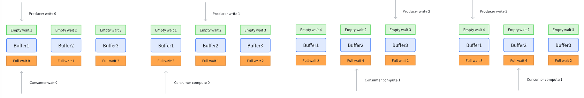
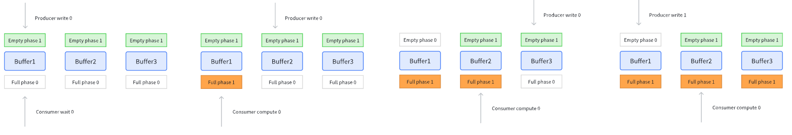

# CUTLASS CUTE 6 Hopper GEMM 高效实现

引入了 tma & wgmma 之后，Hopper 的异步特性相比于 Ampere 得到了显著的增强。异步特性给我们带来性能优化的同事，也带来了不少的挑战，编程范式对比 Amepere 也发生了很大的转变。本文将介绍 Hopper 架构上的重要编程范式/优化核心，包含：warp specialization, producer-consumer model, persistant kernel, cooperative & pingpong schedule。通过这些优化技巧，我们最终能够实现匹配 DeepGEMM (某个Shape🤣) 的高效矩阵乘算法

## Warp Specialization

现在的 tensor core 计算能力远强于数据的运输能力，所以一切的优化都围绕着如何打满 tensor core 的算力。这个过程叫做 "feading the beast"。总体上有两种优化技巧

1. 有效的 threadblock scheduling，以提升 L2 cache hits。这一点在 scheduler 当中体现
2. 流水线并行，overlap copying with math computation

对于流水线并行在 Ampere 架构使用的是 multi-stage 流水线，而到了 Hopper 架构，则大力推广了 warp specialization 算法，其本质是 producer-consumer 模型。一部分 warp 作为 producer，向 buffer 当中输入数据；一部分 warp 作为 consumer，计算 buffer 当中的数据。我认为 producer-consumer 模型更加简洁直观，但是需要更多的同步操作以避免 racing，具体的同步原理在下面的 mbarrier & pipeline 小结中介绍

warp specialization 的代码形式很简单，就是一个 if-else 分支

```c++
if (warp_group_idx == WarpGroupCnt - 1) {
    // producer, elect 1 thread issue tma load
    if (warp_idx_in_group == 0 && elect_one_sync()) {
    producer(param, shared_storage, block_rank_in_cluster);
    }
} else {
    // consumer
    consumer(param, shared_storage);
}
```

疑问一：在之前的 SIMT 编程思想下，写 if-else 分支是效率比较低的行为。为什么在 warp specialization 就可以被允许了？

> From Kimi
>
> 经典 SIMT 以 32 线程的 warp 为最小调度单位，同一个 warp 里的线程只要条件不同就会顺序执行 if 和 else 两段指令，造成浪费。
> Hopper 的 warp specialization 把粒度拉大到「整个 warp-group」（通常是 128 线程甚至 4-warp-group 的 512 线程）。也就是说，只要一个 warp-group 里的所有线程都走同一条路径，就不会出现传统意义上的 divergence。

疑问二：对于 producer 来说，只有一个 thread 在进行操作，那其他的 thread 是不是就没有工作了？在此情况下还会给他们一起分配寄存器之类的资源吗（根据 SIMT 编程原则）？

> From Kimi
>
> 是的，**整个 warp group 都会进入 producer 分支**，但**真正干活的只有 warp group 里被 `elect_one_sync()` 选出来的那一个 thread**，其余 127 个 thread 在这条代码路径上就是“空转”

## Producer-Consumer & Mbarrier

在 GEMM 计算中最核心的需求就是打满算力，而打满算力的核心就是高效的流水线，高效流水线的核心则是准确的同步机制。我将在这一小节里讨论如何利用 mbarrier 建立 producer-consumer 流水线模型的同步机制

mbarrier 将分为两类

- full barrier

    维护 shared memory 是否完成写入的状态。如果未完成写入，则对应 shared memory consumer 无法运行

- empty barrier

    维护 shared memory 是否完成计算的状态。如果未完成计算，则对应 shared memory producer 无法运行

首先我将建立一个清晰的 producer-consumer 模型，然后我将逐步介绍其中的流水线原理，并最后引出 cutlass 当中的同步机制

### producer-consumer 模型

为了简单且不失一般性地构建模型，我定义在该模型中，有一个 prodcuer 和一个 consumer，并且存在有 3 个 buffer 用于存放数据（stages=3）。在更复杂的模型中，可以有更多的 producer & consumer & buffer

对于每一个 buffer 有两个 barrier：empty barrier & full barrier，只有当 buffer empty 时才能进行 produce，只有当 buffer full 时才能进行 consume


### 我的同步机制

如果让我来设计一个同步机制的话，我会考虑让每一个 barrier 有 0/1 两种状态，0 代表 barrier 生效，1 代表 barrier 可通行。举个例子：对于 empty barrier 来说，0 代表 `isEmpty=0`，那么 empty barrier 生效，producer 无法写入；1 代表 `isEmpty=1`，此时 empty barrier 可通行，producer 可写入

在初始化时，所有 buffer 的 `isEmpty=1, isFull=0`，然后 producer 和 consumer 都从 buffer0 开始工作，二者工作完成后需要设置 barrier 以确保同步

- 当 producer 完成写入过后，需要设置 `isFull=1, isEmpty=0`
- 当 consumer 完成计算过后，需要设置 `isFull=0, isEmpty=1`


这样就能保证 producer 在写入时，consumer 不会读取；consumer 在计算时，producer 不会写入。我认为这样的同步机制相当直观，但是 cutlass cute 并没有使用这样的机制

### cute 同步机制-fake

cutlass 选择使用了以 data index 来作为同步机制（即等待第 x 个 data）。每一个 barrier 将有一个计数器 `x`，作为同步标准。具体来说：对于 empty barrier 来说，当 `x=1` 时，**代表只有 data index 小于 1 的数据能够被写入**；对于 full barrier 来说，当 `x=1` 时，代表只有 data index 小于 1 的数据能够被计算

在初始化时，3 个 empty barrier 计数器初始化为 1、2、3，而 3 个 full barrier 计数器初始化为 0、1、2。data index 从 0 开始，producer 和 consumer 都从 buffer0 开始工作，二者工作完成后需设置 barrier 计数器以确保同步

- 当 producer 完成写入过后，更新 full barrier count += buffer count (3 in our case)
- 当 consumer 完成计算过后，更新 empty barrier count += buffer count



### cute 同步机制-real

而对于 cutlass 来说还进行了两个改进：

1. 使用 1-bit 计数器计算 barrier 计数器

    这是因为，producer 能够超越 consumer 的 stages 数量不会超过 3（buffer 总数），即超过的 stages 数量被限制到了一轮以内。所以 empty barrier & full barrier 之间的 count 差值只有可能有两个值：{1, 2}。我们此时就可以用 1-bit {0, 1} 的状态来表示这两个差值。此刻应该有一个直觉：重要的不是这是第几批数据，而是这是**第几轮**数据，一轮数据即为完成一次所有 buffer 的写入/读取所需的数据。**如果把之前的 counter & index 按照轮数进行递增仍然能够获得正确的同步流水线**

2. 使用 1-bit 计数器计算 data index

    为了配合 1-bit 计数器，data index 也要 1-bit 化。我们希望：对于同一轮的数据拥有相同的 1-bit data index。那么计算公式也很明了

    ```python
    data_index = 0
    for i in range(count // stages):
        data_index ^= 1
    ```

    需要注意的是：虽然 data index 在一轮 stages 中是不变的，但是不同 buffer 对应的数据仍是不同的

而在 cutlass 当中并不把这两个 1-bit 计数器称之为 counter，而是称之为 **phase**： **phase 代表了这是第几轮的数据，更具体的来说，其确认了当前是奇数轮还是偶数轮**。此时 barrier 的同步机制变为：**当 barrier phase 和 data index phase 相同时，barrier 生效；反之 barrier 可通行**。producer 和 consumer 的更新规则变为：

- **当 producer 完成写入过后，full barrier phase flip**
- **当 consumer 完成计算过后，empty barrier phase flip**



在实际的编程的过程当中，将会按照 warp specialization 的形式进行开发，也就是说会分别开发 producer 和 consumer，**他们的 pipeline states 可以不用保持一致**，所以在一开始初始化时，可以把 producer 和 consumer 的 phase 都设置为 0，但是 **producer 和 consumer 的 pipeline states phase 分别设置为 1 和 0**，这样也能够达到上述流水线效果，只是完全不方便直观理解。但这么做的一个好处是，设置 pipeline states phase 的成本或许会比设置 mbarrier phase 的成本更低，因为一个是在 register level，一个是在 smem level

### mbarrier & pipeline states 实现机制

为了构建以上功能，cutlass 使用了两个对象 `mbarrier` & `pipeline_staes` 来进行管理。其中 `mbarrier` 就对应着上述的 full barrier & empty barrier，`pipeline_states` 则对应着 data index

- mbarrier 的内部机制

    通过阅读 PTX doc 知道了 mbarrier 管理同步的机制

    1. mbarrier 实际上有4个成员：phase, arrive count, pending count, tx-count

        mbarrier 的[初始化](https://docs.nvidia.com/cuda/parallel-thread-execution/#parallel-synchronization-and-communication-instructions-mbarrier-init)只传入一个 `count`，此时

        - Initializing the current phase to 0.
        - Initializing the expected arrival count to `count`.
        - Initializing the pending arrival count to `count`.
        - Initializing the `tx-count` to 0.

    2. [arrive](https://docs.nvidia.com/cuda/parallel-thread-execution/#parallel-synchronization-and-communication-instructions-mbarrier-arrive-on) 会 decreament pending count

    3. [expect_tx](https://docs.nvidia.com/cuda/parallel-thread-execution/#parallel-synchronization-and-communication-instructions-mbarrier-expect-tx-operation)(bytes) 会增加 tx-count  += bytes

    4. tma copy 会自动调用 [complete_tx](https://docs.nvidia.com/cuda/parallel-thread-execution/#parallel-synchronization-and-communication-instructions-mbarrier-complete-tx-operation)，会减少 tx-count -= bytes。查看 tma load 的 ptx 就可以看到其中有 complete_tx 的 qualifier 字段

    5. 当 pending count = 0 以及 tx-count = 0 时，触发 [phase complete](https://docs.nvidia.com/cuda/parallel-thread-execution/#parallel-synchronization-and-communication-instructions-mbarrier-phase-completion) 条件，此时：

        1. phase flip: phase ^= 1
        2. pending count 还原会 `count`

- pipeline states 的内部机制

    其实 pipeline states 有两个核心成员：`phase` & `stage_idx`，我们通常对 pipeline states 进行递增来进行 phase 计算

    ```c++ 
    template <int kStage = Stage> struct PipelineState {
        uint32_t phase;
        uint32_t stage_idx;
    	void operator++(int) {
        if ((++stage_idx) == kStage) {
            phase ^= 1;
            stage_idx = 0;
        }
        }
    ```

## Fence & Visibility

在之前的很多小节里都触及了 fence sync，并且很多文档都喜欢以 visibility 来描述 fence 的作用，visibility 表面上很具象，实际上理解起来很抽象。个人觉得还是以最本质的 fence 功能来理解：确保代码的执行顺序。对我来说 xx fence 意味着某个操作不能够越过 fence 进行执行**（此理解可能有误，但我还是这样写，帮助自己理解）**，例如：

```c++
// smem write
tma_store_fence()
// tma store
```

这意味着 tma store 操作必须要在 smem write 完成之后再开始发起。而需要 fence 的本质原因是因为 tma 和 smem 是不同的硬件，他们之间的操作其实是不可见的，**由于 relaxed consistency model 的原因，导致 tma store 的操作可能会提前执行，所以需要 fence 来保证不同硬件之间的操作顺序**

1. madatory constraint

    - mbarrier init 之后一定要使用 fence mbarrier init
    - wgmma 使用前一定要使用 `warpgroup_arrive`

2. 在 generic proxy 和 async proxy 之间

    所谓的 async proxy，在目前所接触的范围里只有 tma & wgmma 操作

    1. `tma_store_fence` 确保 tma store 一定在 rmem -> smem 写入完成之后。另外根据 [PTX](https://docs.nvidia.com/cuda/parallel-thread-execution/#async-proxy) 的描述，在 tma load/store 完成过后会隐式地调用 fence，所以我们不需要在 tma store 完成过后使用 fence
    2. `warpgroup_arrive` 确保 register 的操作一定在 wgmma 完成之后

        就是 PTX `wgmma.fence.sync.aligned`，阻止编译器把 mma 与之前的寄存器操作重排，所以用作如下

        ```cpp
        warpgroup_fence_operand(acc);// seems unnecessary
        warpgroup_arrive();
        ...
        wgmma(..., acc);
        ...
        warpgroup_fence_operand(acc);// seems unnecessary
        ```

3. wait 同步的屏障效应

    例如：empty arrive 一定不会被重排到 warpgroup wait 之前

    例如：wgmma 一定不会被重排到 full barrier wait 之前

    例如：tma load 一定不会被重排到 empty barrier wait 之前

## Persistant Kernel & Scheduler

### Persistant Kernel 概念

我将 scheduler 和 persistant kernel 放在一起整理，二者有着紧密的联系。persistant kernel 一般和 warp specialization 是一起出现的，所以有时候也叫 persistant warp 下面由 Kimi 解释一下其概念

> From Kimi K2.5
>
> 传统的 CUDA kernel 执行模式是：一个 thread block 处理一个任务 tile，完成后就退出。而 **Persistent Kernel** 让 kernel 常驻在 SM 上，同一个 thread block 会**连续处理多个任务 tiles**，直到所有工作完成才退出。

对于 gemm 来说 persistent kernel 由如下几点优势：

1. 一个 cta 处理多个 tiles，而不是一个 cta 处理一个 tile，减少了 context switch 开销
2. 能够提前预取下一批处理的 tile 数据，重叠计算和数据传输
3. 可以通过 scheduler 显式地控制 cta 处理 tile 的顺序，以获得更好的 L2 cache 利用率 

### 设计 Scheduler

假设我们有一个虚拟的 GPU，其有 2个 SM，在 persistant kernel 场景下，每一个 cta 会不断地计算 tiles

```txt
SM0: 0th tile, 2nd tile, 4th tile, ...
SM1: 1st tile, 3rd tile, 5th tile, ...
```

问题来自于：第 0,1,2,3... 个 tile 他们到底对应着矩阵的哪个部分？我们当然可以简单地直接用 natural layout 的顺序（column major）来决定 `iteration_idx -> (m_idx, n_idx)` 之间的映射


不过正如 [Nvidia Cute 实战-WarpSpecialization Gemm for Hopper - 知乎](https://zhuanlan.zhihu.com/p/1905383022901059783) 中所说：为了L2 cache 最大化命中率，我们需要最小化 L2 cache 的访问量。其原理也在博客当中叙述得非常清晰。所以我们需要控制 `iteration_idx -> (m_idx, n_idx)` 映射，这种特定的迭代方式也被称为 thread block swizzle。以 swizzle size = 4 + N-dim along 为例，我们就先在 m-dim 上进行迭代，然后每 4 个 m blocks 就会跳转出去


这样的从 layout algebra 的角度来说非常简单，类似于 zipped divide。按照上述的描述，先用 4 对第一个 mode 进行 divide，然后再 flatten & permute

```cpp
(8, 16):(1, 8) -> ((4,2), 16):((1,4), 8) -> (4, 16, 2):(1, 8, 4)

// actual cute code
auto mn = make_layout(make_shape(8, 16));
auto tiler = make_tile(4);
auto iteration2mn = logical_divide(mn, tiler);	
auto mn = make_layout(make_shape(8, 16));
auto tiler = make_tile(4);
auto mn_divided = flatten(logical_divide(mn, tiler)); // (4,2,16):(_1,4,8)
auto iter2mn = make_layout(select<0, 2, 1>(mn_divided.shape()), select<0, 2, 1>(mn_divided.stride())); // (4,16,2):(_1,8,4)
```

以上是 cute 的解法，算是一个小练习吧。不过代码通常直接来计算 `(m_idx, n_idx)`，我用 python 来表示，only 6 lines of code

```python
def thread_block_swizzle_N_dim_along(iteration_idx, num_m_blocks, num_n_blocks, swizzle_size):
    # first we calculate which box we are in, box size is (swizzle_size, num_n_blocks)
    box_idx = iteration_idx // (swizzle_size * num_n_blocks)
    # get actual swizzle_size, because there might not be enough blocks along m
    swizzle_size = min(swizzle_size, num_m_blocks - box_idx * swizzle_size)
    # get idx inside of the box
    inside_box_idx = iteration_idx % (swizzle_size * num_n_blocks)    
    
    # calculate inside box m_idx, n_idx
    m_idx = inside_box_idx % swizzl_size
    n_idx = inside_box_idx // swizzle_size
    
    # modify in m_idx index to global index, we can merge it in previous step
    # but for better understanding here, we modify it separately
    m_idx = m_idx + box_idx * swizzle_size
    return m_idx, n_idx
```

下面是剩下的 m blocks 不够的情况的可视化，对应上方代码中更新 `swizzle_size` 的部分


## Coorperative & PingPong Schedule

### 基础概念

[关于Pingpong和Cooperative的一些感性理解 - 知乎](https://zhuanlan.zhihu.com/p/1922067252909434076)

[Pingpong Schedule并不是万能钥匙 - 知乎](https://zhuanlan.zhihu.com/p/1935338652726204054)

这两篇博客对 Cooperative 和 PingPong schedule 有一个比较详细讨论。我会先对二者的概念进行阐述，然后整理各自的优势

1. Cooperative Schedule

    利用两个 warp group 完成一个 CTATile 矩阵乘法，二者分别负责 Tile 的上下部分。其在代码中是通过 TiledMMA 构建的，非常直观

    ```cpp
    using mma_op = GMMA::MMA_64x256x16_F16F16F16_SS<GMMA::Major::K,  GMMA::Major::K>;
    using TiledMMA = decltype(make_tiled_mma(mma_op{}, make_layout(make_shape(_2{}, _1{}, _1{}))));
    ```

    我们定义了 `MMAThrLayout` 为 `(2, 1, 1)`，将矩阵乘大小从 `64x256x16` 扩展到了 `128x256x16`。这里贴一个 Cooperative 运行的图示（该图我认为有一定争议，在下一小节 Cooperative vs PiongPong 进行解释）

    

2. PingPong Schedule

    利用两个 warp group 分别完成两个 CTATile 矩阵乘法，二者交替进行来掩藏 epilogue 开销。其在代码中的控制流会相对复杂，除了 full barrier & empty barrier 之外还需要额外 pingpong barrier 以控制两个 warp group 的交替进行。同样贴一个 PingPong 运行时的图示

    

    需要注意的是，通常 PingPong 完成的单个 CTATile 大小相对于 Cooperative 完成 CTATile 会减半，但二者完成的 CTATile 的总大小是一致的

### Cooperative vs PingPong

这样看起来 PingPong 是完胜 Cooperative 的性能的，因为其能够掩藏 epilogue 的时间，但 Cooperative 不行。事实真是如此吗？在[Pingpong Schedule并不是万能钥匙 - 知乎](https://zhuanlan.zhihu.com/p/1935338652726204054) 中提到了一个事实：对于 H100 等高算力 GPU 上，Cooperative 比 PingPong 在 fp8 blocksize gemm 上更好。原因有多个：

1. 在于 Cooperative 能够掩藏 mainloop 当中对 accumuator 的 CUDA Core 计算（i.e. acc = fp8 * fp32 scale），而 PingPong 则不行。该事实也挑战了上面 cooperative 图示，因为两个 warp group 并不是同时进行的，而是有一个先后顺序

2. Cooperative 的 cta shape 更大，在 epilogue 当中用 tma 发送大块的数据更有效率，指令更少

3. 最后我想 challenge 一点：Cooperative 真的完全无法掩藏 epilogue 的时间吗？mainloop 可以大致分为三个部分：

    ```cpp
    wgmma;
    rmem -> smem;	// stsm
    smem -> gmem;	// tma store
    ```

    实际上我们在 `smem -> gmem` 的过程中不需要等待其结束就可以开始下一轮的 mma 计算。**这里数据传输和 mma 计算仍然是重合的**

可以看见 Cooperative 以更简洁的实现获得了更加优越的性能，所以在下面的 gemm 实践中我将优先考虑 Cooperative 方式

## GEMM 实践

[Nvidia Cute 实战-WarpSpecialization Gemm for Hopper - 知乎](https://zhuanlan.zhihu.com/p/1905383022901059783)

介绍了这么多优化技巧，接下来我们就来使用他们来构建高效的 Hopper fp16 gemm kernel，最终达到 DeepGemm 水平⚡所使用的核心优化技巧：

1. 使用 tma 进行高效 `smem <-> gmem` 数据传输
2. producer-consumer 流水线，尽量打满 wgmma tensor core
3. persistant kernel with thread block swizzle
4. Cooperative gemm with large mma shape & partial epilogue overlap

代码请移步 [DeepCute/deepcute/sm90/fp16_gemm/gemm_ws.h at master · DeclK/DeepCute](https://github.com/DeclK/DeepCute/blob/master/deepcute/sm90/fp16_gemm/gemm_ws.h) 进行查看，~300 lines of code，clean and readable！

对不同实现的 kernel profile 如下

| Impl. / MNK              | 4096x4096x1024 time/us | 2048x2048x2048 time/us |
| ------------------------ | ---------------------- | ---------------------- |
| Awesome-Cute Cooperative | 276.0                  | 154.1                  |
| Awesome-Cute PingPong    | 264.5                  | 152.0                  |
| Cutlass Cooperative      | 284.1                  | 157.2                  |
| Cutlass PingPong         | 276.0                  | 156.4                  |
| DeepGemm                 | 268.2                  | **135.7**              |
| My implementation        | **266.1**              | 152.0                  |

对于不同的 shape 会采取不同的策略：CTATile shape, mma shape 等等。对于 `4096x4096x1024` 的矩阵乘法上，我在策略上是对齐 DeepGemm，可以看到几乎打平，而对于 `2048x2048x2048` 的矩阵乘法我还是沿用了 `4096x4096x1024` 的策略，则是大幅度落后。具体原因我还不清楚，学习 GPU 之路任重道远，欢迎大家评论区进行讨论🤔