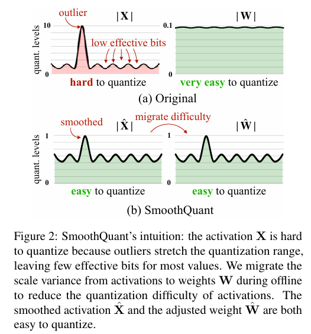
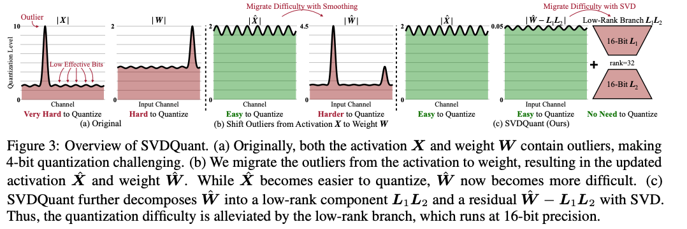
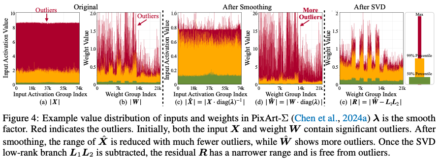
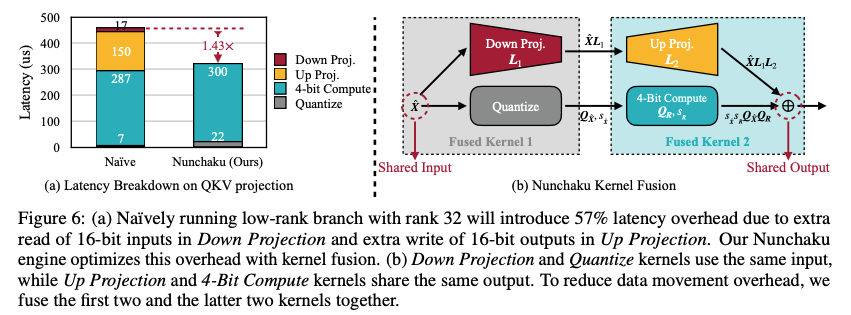
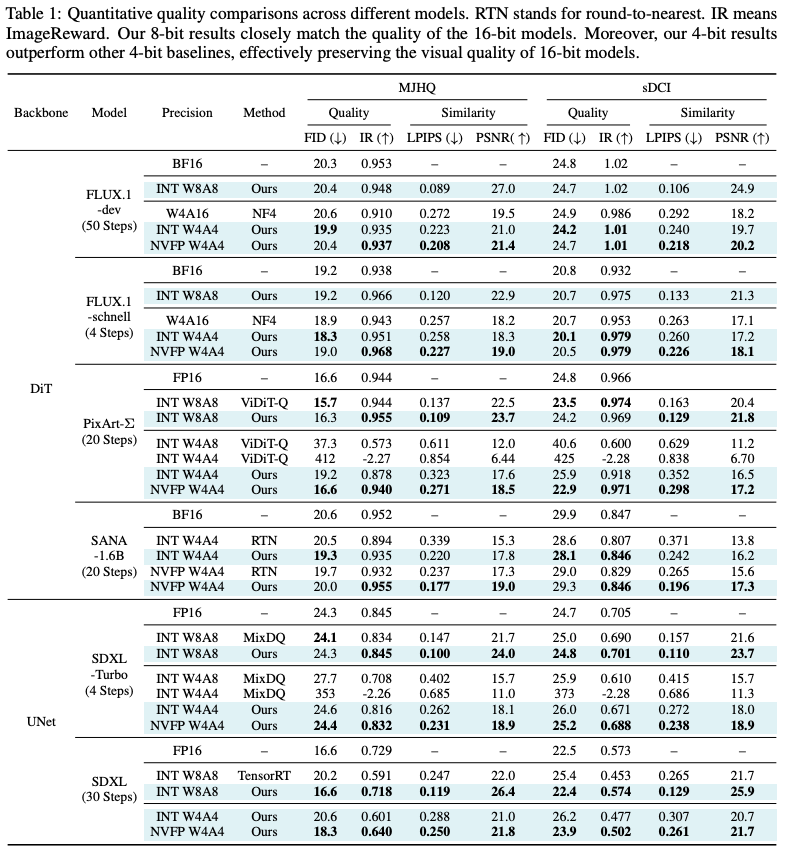
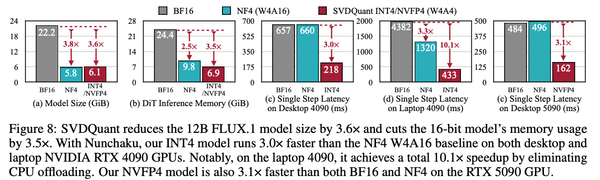
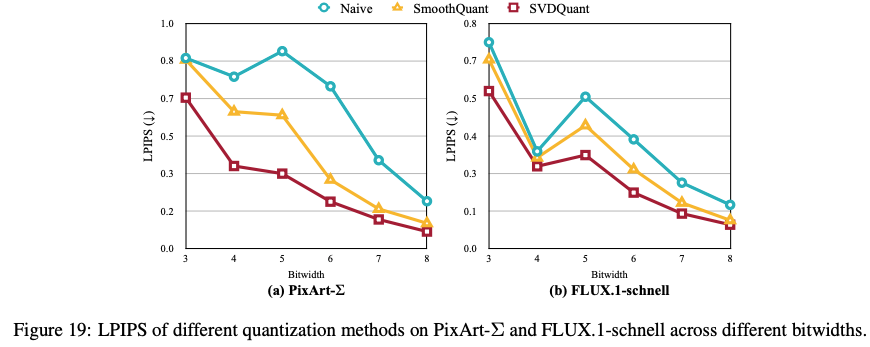

# From SmoothQuant to SVDQuant

本文将从一个统一的理论分析，对三个量化方法进行总结：SmoothQuant & AWQ & SVDQuant。这三个方法均来自于 MIT Han Lab，所以这三个方法能统一起来也不奇怪。希望通过文本，能够让大家理解大模型量化的常用形式与基本原理

## 量化基础

什么是量化？其本质是用低比特数来表示高比特数，这将带来硬件上带宽和计算的成倍优势：低比特传输数据成倍减少，同时低比特运算速度成倍增加。我们通常在实践中使用的 int 对称量化公式如下

$$
Q(W) = \Delta·\text{Round}(\frac{W}{\Delta}) \\ \Delta = \frac{\max{(|W|)}}{2^{N-1}-1}
$$

其中：

1. $\Delta$就是量化中常说的 scale
2. $Round(\frac{W}{\Delta})$就是我们需要保存的量化数值，$W$既可以是权重也可以是激活
3. $Q(W)$为反量化过后的浮点数

还有一点再解释一下：为什么是用$2^{N-1}-1$作为$\Delta$的分母？而不使用$2^{N-1}$？

以 int8 为例子，该分母算出来为 127，而不是 128。这说明 scale 将浮点数缩放到了 -127~127 这个范围中，一共有 255 个可选数值。如果我们直接使用$2^{N-1}$作为分母，则会将浮点数缩放到 -128~128 范围，这样一共有 257 个数值需要表示，超出了 int8 的表示范围

对于 fp8 量化来说过程也是类似：**先将高比特浮点数缩放到低比特能够表示范围内，然后利用 round to nearest 获得低比特数值**

此时一个高比特浮点数需要两个数值来表示：一个高比特的浮点 scale，和一个低比特数值。似乎量化并没有为我们节省什么，这又多出来一个高比特的 scale。然而在量化过程中，通常有一大批数值都需要量化，**我们可以让一批数值共享同一个高浮点 scale（例如每 128 个数值共享一个 scale），这样就节省了 scale 开支，绝大部分的数值表示都是以低比特形式存在**

**此时有一个重要的结论需要给出：对于一组需要量化的数值中，如果其中存在异常值（outlier）显著地比其他数值要大，那么其量化误差就会非常大。**这也不难理解，以 int 量化为例，异常值导致了 scale 的计算结果很大，数值与数值之间的差异必须以 scale 的整数倍存在，要么大家都是相同数值，要么大家差别很大

## LLM 量化误差分析

前提：在深度学习中，由于模型的层数可以非常深，所以想要对一整个网络进行误差分析是相当困难的事情。绝大部分的量化误差理论分析都仅限于对单个矩阵乘法当中。如果想要考虑多个网络层，可能用 QAT 的方式进行端到端的训练才是可行的方法。以下理论分析整理自 SVDQuant

矩阵乘法量化误差的定义

$$
E(\boldsymbol{X},\boldsymbol{W})=\|\boldsymbol{X}\boldsymbol{W}-Q(\boldsymbol{X})Q(\boldsymbol{W})\|_{F}
$$

为了方便描述，定义上述矩阵的形状：`X.shape = (m, k) & W.shape = (k, n)`

Frobenius 范数定义

$$
\|A\|_F = \sqrt{\sum_{i=1}^{m} \sum_{j=1}^{n} |a_{ij}|^2} = \sqrt{\operatorname{tr}(A^H A)}
$$

SVDQuant 利用缩放得到了量化误差的一个上界，如下所示

$$
E(\boldsymbol{X},\boldsymbol{W}) \leq \|\boldsymbol{X}\|_{F} \|\boldsymbol{W} - Q(\boldsymbol{W})\|_{F} + \|\boldsymbol{X} - Q(\boldsymbol{X})\|_{F} \left( \|\boldsymbol{W}\|_{F} + \|\boldsymbol{W} - Q(\boldsymbol{W})\|_{F} \right)
$$

证明过程如下，本质上利用了三角不等式和柯西不等式

$$
\begin{align*}
&\|\boldsymbol{X}\boldsymbol{W} - Q(\boldsymbol{X})Q(\boldsymbol{W})\|_F \\
&= \|\boldsymbol{X}\boldsymbol{W} - \boldsymbol{X}Q(\boldsymbol{W}) + \boldsymbol{X}Q(\boldsymbol{W}) - Q(\boldsymbol{X})Q(\boldsymbol{W})\|_F \\
&\leq \|\boldsymbol{X}(\boldsymbol{W} - Q(\boldsymbol{W}))\|_F + \|(\boldsymbol{X} - Q(\boldsymbol{X}))Q(\boldsymbol{W})\|_F \\
&\leq \|\boldsymbol{X}\|_F \|\boldsymbol{W} - Q(\boldsymbol{W})\|_F + \|\boldsymbol{X} - Q(\boldsymbol{X})\|_F \|Q(\boldsymbol{W})\|_F \\
&= \|\boldsymbol{X}\|_F \|\boldsymbol{W} - Q(\boldsymbol{W})\|_F + \|\boldsymbol{X} - Q(\boldsymbol{X})\|_F \|\boldsymbol{W} - (\boldsymbol{W} - Q(\boldsymbol{W}))\|_F \\
&\leq \|\boldsymbol{X}\|_F \|\boldsymbol{W} - Q(\boldsymbol{W})\|_F + \|\boldsymbol{X} - Q(\boldsymbol{X})\|_F \left(\|\boldsymbol{W}\|_F + \|\boldsymbol{W} - Q(\boldsymbol{W})\|_F\right).
\end{align*}
$$

我们去优化此上界就能够优化量化误差，而该上界由2个关键因素限制

1. **activation & weight 的 F-范数大小**
2. **activation & weight 的量化误差大小**

对于 activation & weight 的量化误差，几乎是无法消除的，这是由于 round 操作的天然属性。**所以降低 activation & weight 的 F-范数大小成为了降低矩阵乘法量化误差的关键**

## SmoothQuant-W8A8

SmoothQuant 论文的核心结论：

1. activation 异常值过大，导致量化误差很大，但是 weight 的异常值较少

2. activation 异常值分布不是随机的，而是在在某些固定 channel。通过缩放因子$s$，把 activation 的异常值，转移到权重上，同时保持运算的等价性。
    
    $$
    Y=(X·diag(s)^{-1})·(diag(s)W)=\hat{X}\hat{W}
    $$
    
    

我们仍然从上述得到的误差上界来分析

$$
E(\boldsymbol{X},\boldsymbol{W}) \leq \|\boldsymbol{X}\|_{F} \|\boldsymbol{W} - Q(\boldsymbol{W})\|_{F} + \|\boldsymbol{X} - Q(\boldsymbol{X})\|_{F} \left( \|\boldsymbol{W}\|_{F} + \|\boldsymbol{W} - Q(\boldsymbol{W})\|_{F} \right)
$$

SmoothQuant 将其中的$X,W$替换成为了$\hat{X},\hat{W}$，降低了 activation 的 F-范数大小，也通过减少异常值来减少 activation 的量化误差。需要注意的是：

1. 此缩放会增加权重 F-范数大小，所以上述公式的第二项一定会增加，但是相比第一项占比很少，所以影响不大
2. 此缩放会增加权重当中的 outliers，从而导致权重量化误差$\|\boldsymbol{W} - Q(\boldsymbol{W})\|_{F}$显著增加，不能够无限制地进行缩放

所以如何寻找最优的缩放因子$s$是 SmoothQuant 的另一贡献。方法也非常简单，以 activation 和权重作为 reference，通过格点搜索超参数$\alpha$来获得最优缩放因子

$$
s_j = \frac{max(X_j)^{\alpha}}{max(W_j)^{1-\alpha}}
$$

其中$j$表示第$j$个channel，目标函数就是量化误差

$$
E(\boldsymbol{X},\boldsymbol{W})=\|\boldsymbol{X}\boldsymbol{W}-Q(\boldsymbol{X})Q(\boldsymbol{W})\|_{F}
$$

## AWQ-W4A16

AWQ 其实就是 SmoothQuant 的 weight-only 版本，其理论分析更加简单

$$
E(\boldsymbol{X},\boldsymbol{W}) \leq \|\boldsymbol{X}\|_{F} \|\boldsymbol{W} - Q(\boldsymbol{W})\|_{F} + \|\boldsymbol{X} - Q(\boldsymbol{X})\|_{F} \left( \|\boldsymbol{W}\|_{F} + \|\boldsymbol{W} - Q(\boldsymbol{W})\|_{F} \right)
$$

对于 w4a16 weight-only 量化，activation 的量化误差就不存在了，所以上式的第二项直接为零。

$$
E(\boldsymbol{X},\boldsymbol{W}) \leq \|\boldsymbol{X}\|_{F} \|\boldsymbol{W} - Q(\boldsymbol{W})\|_{F}
$$

此时直接缩小 activation 的 F-范数将变得非常有收益，这也就是 AWQ 方法的直接体现。SmoothQuant 的缩放方式、搜索方式仍然适用于 AWQ，所以我说 AWQ 就是 SmoothQuant weight-only 版本。由于 AWQ 的情况更简单，所以在此我们还可以对误差分析做得更精确一些，比如：被缩放的权重所造成的误差到底有多大？

$$
\boldsymbol{W} - Q(\boldsymbol{W}) = \boldsymbol{W} - \Delta·\text{Round}(\frac{\boldsymbol{W}}{\Delta})=\Delta ·\text{RoundErr}(\frac{\boldsymbol{W}}{\Delta})
$$

其中$\text{RountErr}(·)$可以看做一个近似于 uniform distribution$X\sim\mathcal{U}(0,\,0.5)$的分布函数，其平均误差为 0.25。所以当$\Delta$没有变化时，可以认为权重量化的误差也变化不大。但是当我们进行缩放时，是有可能改变$\Delta$的，其由权重缩放过后的权重最大值决定，以 int 量化为例子

$$
\Delta = \frac{\max{(|W|)}}{2^{N-1}-1}
$$

当最大值放大两倍，会导致$\Delta$放大两倍，同时误差也会放大两倍，这也是我们为什么不能无限制地缩放 activation 的原因

## SVDQuant-W4A4

SVDQuant 比 SmoothQuant 将更加强大，其要解决 W4A4 的量化精度问题。SmoothQuant (W8A8) 会将 activation outlier 转移到权重当中，但是对于 W4A4 的量化方法，这种 smoothing 方式也将受到更多限制，**因为 4-bit 权重无法像 8-bit 权重一样对 outlier 有很好的精度保证**

**解决思路：**使用一个 low-cost branch 将这些 outlier 进行吸收。具体来说，论文先利用 smoothing 的方式将 activation 的 outlier 移动到 weight 上，然后将 weight 的 outlier 用两个低秩矩阵$L_1L_2$进行吸收。具体来说 weight$W$将被分解为两个部分：

$$
W = R + L_1L_2
$$

最终得到的 residual$R$会是一个更好量化的矩阵。如此 activation & weight 都能够进行很好的 4-bit 量化





论文在 related work 中也提到了其他方法也使用了 low-rank 的方式来做量化，不过他们的缺陷在于没办法做出加速效果，只专注于权重压缩效果。实际上把量化模型进行加速并不简单，这就是写算子的魅力时刻🫡

### SVDQuant Method

SVDQuant 首先也采用 AWQ/SmoothQuant 当中的 smoothing 方法，把 activation 当中的 outlier 转移到 weight 当中

$$
\hat{\boldsymbol{X}}=\boldsymbol{X}\cdot\operatorname{diag}(\boldsymbol{\lambda})^{-1}\\
\hat{\boldsymbol{W}}=\boldsymbol{W}\cdot\operatorname{diag}(\boldsymbol{\lambda})
$$

经过放缩的 weight 现在的 outlier 也会变得比较多，论文使用一个 low-rank 分支来把这些异常值进行转移，留下一个 outlier 较少的 residual 部分

$$
\hat{\boldsymbol{W}}=\boldsymbol{L}_{1}\boldsymbol{L}_{2}+\boldsymbol{R}\\
\boldsymbol{X}\boldsymbol{W}=\hat{\boldsymbol{X}}\hat{\boldsymbol{W}}=\hat{\boldsymbol{X}}\boldsymbol{L}_{1}\boldsymbol{L}_{2}+\hat{\boldsymbol{X}}\boldsymbol{R}\approx\underbrace{\hat{\boldsymbol{X}}\boldsymbol{L}_{1}\boldsymbol{L}_{2}}_{\text{16-bit low-rank branch }}+\underbrace{Q(\hat{\boldsymbol{X}})Q(\boldsymbol{R})}_{\text{4-bit residual }}.
$$

其中两个低秩矩阵的形状为 `L_1.shape = (m, r) & L_2.shape = (r, k)`

如此一来，矩阵乘法被分解为了两个部分：由 activation & low-rank 组成的高精度运算 + 由 activation & residual 组成的低精度运算。其中高精度运算的 tops 由于低秩的存在，会显著较低，可得其计算占比

```python
# r << min(m, n, k), usually 16 or 32
ratio = (m * r + n * r) / (m * n)
```

**现在我们的目标就是要找到足够好的低秩矩阵，让矩阵乘法的量化误差最低**。将低秩矩阵带回原来的矩阵量化误差式子中

$$
\|\hat{\boldsymbol{X}}\hat{\boldsymbol{W}}-\left(\hat{\boldsymbol{X}}\boldsymbol{L}_{1}\boldsymbol{L}_{2}+Q(\hat{\boldsymbol{X}})Q(\boldsymbol{R})\right)\|_{F}=\|\hat{\boldsymbol{X}}\boldsymbol{R}-Q(\hat{\boldsymbol{X}})Q(\boldsymbol{R})\|_{F}=E(\hat{\boldsymbol{X}},\boldsymbol{R})
$$

可以看到最终的误差从原来的$E(X, W)$变为了当前的$E(\hat{X}, R)$。**此时回顾之前的矩阵量化误差分析结论：影响矩阵量化误差的2个关键因素就是 activation & weight 的 F-范数**。换句话说，我们现在想要做的就是降低$\hat{X}$和$R$矩阵的 F-范数。而$\hat{X}$是已经利用了 smoothing 方法进行优化，论文就不做进一步的讨论，问题进一步简化为：寻找足够好的低秩矩阵，以最小化$R$矩阵的 F-范数大小 

$$
\|\boldsymbol{R}\|_{F}=\min_{L_1,L_2}\left\|\hat{\boldsymbol{W}}-\boldsymbol{L}_{1}\boldsymbol{L}_{2}\right\|_{F}
$$

这个问题其实早就被 SVD (Singular Value Decomposition) 给解决了。在 SVD 的语言中，这里就是在寻找 `rank=r`  的$\hat{W}$矩阵的最优近似，即：$\hat{W}$矩阵的低秩近似。这里直接给出结论：$\|\boldsymbol{R}\|_{F}$的最小值就是$\hat{W}$中 `i>r` 的奇异值的的几何平均$\sqrt{\sum_{i=r+1}^{\min(m,n)}\sigma_{i}^{2}}$，而低秩矩阵则表示为

$$
\hat{\boldsymbol{W}}=\boldsymbol{U}\boldsymbol{\Sigma}\boldsymbol{V}\\\boldsymbol{L}_{1}=\boldsymbol{U}\boldsymbol{\Sigma}_{:,r}\\\boldsymbol{L}_{2}=\boldsymbol{V}_{:r,:}
$$

至此 SVDQuant 的误差理论分析已经结束，经由 smoothing + SVD 的双重优化，降低了 activation & weight 的 F-范数，从而将矩阵乘法误差的显著降低

### SVDQuant 算子优化

由于 SVDQuant 引入了低秩分支，虽然计算量少，但是输入和输出 shape 并没有改变，也需要花费大量的时间用于 memory 操作上。如果不做融合的操作，两个 branch 就会分别对输入和输出进行 memory 读取/写入，这样 memory 的操作就重复了两次。为了解决这个问题， SVDQuant 提出了 Numchaku (双截棍) Fused Kernel 的方式，只对输入和输出进行一次读取/写入，显著减少运行时间



### Experiment

SVDQuant 应该就是受到 LoRA 领域的启发，很有可能其出发点就是想要加速 LoRA 模型。论文的实验都是用的 diffusion 模型，没有 LLM 相关的结果。在 diffusion 评价指标上，SVDQuant 的指标都很好，非常接近 fp16 模型



在运行效率上，能够减少 3.6x 的显存，加速 3x



论文在附录里还和 SmoothQuant 在多个 bit-width 下进行了对比，其结果持续优于 SmoothQuant，但是在 8-bit 下对 SmoothQuant 没有显著优势



另外论文也指出对于 2-bit 量化（W2A4 or W4A2），SVDQuant 无法生成有意义的图像，一些研究也指出对于如此低 bit 的量化需要使用 QAT 的方式来大量更改 weight 的分布
